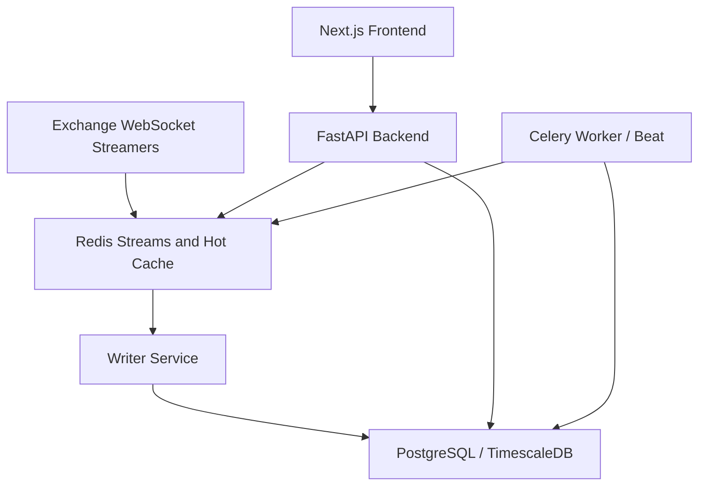

# CryptoInsight / Investment Matrix

Self-hosted crypto market research and paper-trading platform built with FastAPI, PostgreSQL/TimescaleDB, Redis, Celery, and Next.js.

This project currently focuses on reliable local operation for market data ingestion, historical candles, backtesting, paper trading, and portfolio tracking. Real-money trading, ML prediction, and RL agents are not production-ready features in this codebase.

## What Works Today

- FastAPI backend with REST endpoints for coins, market data, indicators, backtests, paper trading, portfolios, imports, and auth.
- PostgreSQL/TimescaleDB schema managed by Alembic migrations.
- Redis-backed live tick cache and Redis Streams writer path.
- Exchange stream adapters for Coinbase, Binance, and Kraken.
- Celery tasks for coin ingestion, historical backfill, imports, and optional paper-trading schedules.
- Market data status tracking so unsupported, warming, stale, and ready assets are visible instead of hidden behind generic N/A signals.
- Local AI Crew desk APIs for run tracking, immutable research snapshots, prediction paths, recommendations, guardrails, audit logs, and guarded autonomous paper-trading execution.
- Next.js frontend with market, pipeline, portfolio, backtest, paper-trading, login, register, and settings screens.
- Backend unit tests, frontend unit tests, Playwright smoke tests, and optional Docker integration tests.

## Requirements

- Docker Desktop
- Git
- Node.js 20 if running the frontend outside Docker
- Python 3.12 if running the backend outside Docker

## Quick Start With Docker

```bash
git clone https://github.com/your-username/investment_matrix.git
cd investment_matrix
copy .env.example .env
docker compose up --build -d
```

Services:

- Frontend: http://localhost:3000
- API health: http://localhost:8000/api/health
- API docs: http://localhost:8000/docs
- API OpenAPI JSON: http://localhost:8000/api/openapi.json

The default Compose file passes the in-network database URL to all backend services:

```ini
DATABASE_URL=postgresql+psycopg2://user:pass@db:5432/cryptoinsight
```

The default Compose frontend is production-built and served from Next.js standalone output so `http://localhost:3000` mirrors the stable self-hosted runtime. For hot reload, run the frontend locally with `npm run dev` instead of the default Compose frontend.

For production-like deployments, set real values in `.env`:

```ini
ENVIRONMENT=production
SECRET_KEY=<long-random-secret>
ENCRYPTION_KEY=<fernet-key>
ADMIN_KEY=<admin-cache-key>
AUTH_COOKIE_SECURE=true
AUTH_COOKIE_SAMESITE=strict
```

Local AI crew runs are optional and disabled by default. To use the Crew desk with a local Ollama model, set:

```env
CREW_ENABLED=true
CREW_LLM_PROVIDER=ollama
CREW_LLM_BASE_URL=http://host.docker.internal:11434
CREW_LLM_MODEL=llama3.1:8b
CREW_MAX_SYMBOLS_PER_RUN=10
```

When disabled or unavailable, `/crew` shows the runtime status and the rest of the app continues to work.

## Local Development

Backend locally with Docker infrastructure:

```powershell
docker compose up db redis -d
python -m venv .venv
.\.venv\Scripts\activate
pip install -r requirements.txt
uvicorn app.main:app --reload --env-file .env.local
```

Worker services in separate terminals:

```powershell
celery -A celery_app:celery_app worker --loglevel=info --pool=solo
python -m app.streamer
python -m app.writer
```

Frontend locally:

```powershell
cd frontend
npm install
npm run dev
```

`docker-compose.local.yml` is intentionally ignored for local overrides. Use `docker-compose.override.example.yml` as the template if you want Compose to read `.env` directly.

## Verification

Backend:

```powershell
.\.venv\Scripts\python.exe -m pytest -q
.\.venv\Scripts\python.exe -m ruff check .
```

Frontend:

```powershell
cd frontend
npm run lint
npm test
npm run build
npm run test:e2e
npm audit --omit=dev
```

Optional Docker integration tests:

```powershell
$env:RUN_DOCKER_INTEGRATION="1"
.\.venv\Scripts\python.exe -m pytest tests/integration -q
```

## Architecture



## Current Non-Goals

- Real-money order execution.
- Real-money autonomous trading.
- Cloud-dependent AI features as a default requirement.
- Public SaaS operation without additional security, observability, and compliance work.

## License

This repository is proprietary. See [LICENSE](LICENSE).
